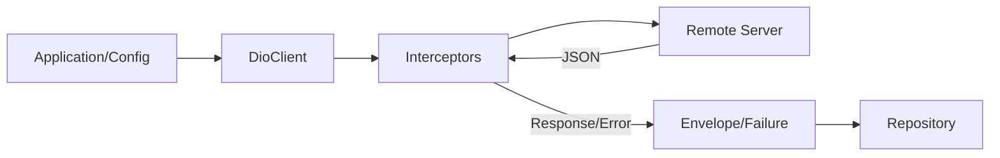

# 🌐 Core Network Module

Module quản lý tầng giao tiếp mạng (HTTP Layer) của ứng dụng.

## 📦 Dependencies Required

Các package bắt buộc phải có trong `pubspec.yaml` để module này hoạt động:

- **dio**: HTTP Client engine
- **equatable**: So sánh object (dùng cho class Failure)
- **retrofit** (Optional): Định nghĩa API Interface (Khuyên dùng)

> 💡 **Lưu ý**: Module này không phụ thuộc vào `injectable`, `get_it` hay `envied`. Bạn có thể tự do lựa chọn giải pháp DI và Config cho dự án của mình.

## 🏗 Cấu trúc & Luồng dữ liệu



## 🔑 Các thành phần chính

### 1. DioClient (`core/network/dio_client.dart`)

Là một wrapper xoay quanh Dio.

- **Standalone**: Nhận `baseUrl` trực tiếp từ constructor, không phụ thuộc vào logic môi trường bên ngoài
- **Auto-config**: Tự động tích hợp `LoggerInterceptor` và `ErrorInterceptor`

### 2. Interceptors (`core/network/interceptors/`)

- **ErrorInterceptor**: Tự động chuyển đổi `DioException` thành `Failure` (Domain Error) chuẩn
- **LoggerInterceptor**: Log request/response đẹp mắt. Không cần cấu hình DI
- **Auth/TokenInterceptor**: (Optional) Có thể inject thêm từ bên ngoài vào `DioClient` nếu cần xử lý Token

### 3. Error Handling (`core/network/failures.dart`)

Sử dụng **Sealed Class** để định nghĩa lỗi. Bắt buộc phải handle đủ các case khi sử dụng:

- `ConnectionFailure`: Lỗi mạng
- `ServerFailure`: Lỗi logic từ backend (có statusCode và errorCode)
- `AuthFailure`: Lỗi 401/Token hỏng
- `UnknownFailure`: Lỗi crash/parse data

### 4. Response Envelope (`core/network/response_envelope.dart`)

Wrapper chuẩn cho API response:

- `Envelope<T>`: Cho single object response
- `ListEnvelope<T>`: Cho list response với pagination metadata

## 📖 Hướng dẫn sử dụng

### Bước 1: Định nghĩa API

Sử dụng Retrofit và annotation `@Extra` (nếu dùng `auth_type.dart`).

```dart
@RestApi()
abstract class ApiService {
  factory ApiService(Dio dio) = _ApiService;

  // API cần Token
  @GET('/users/me')
  @Extra({'auth_type': AuthType.userToken}) 
  Future<Envelope<User>> getMe();

  // API Public
  @POST('/login')
  @Extra({'auth_type': AuthType.none})
  Future<LoginResponse> login(@Body() LoginRequest request);
  
  // API trả về List với Pagination
  @GET('/users')
  Future<ListEnvelope<User>> getUsers(@Query('page') int page);
}
```

### Bước 2: Khởi tạo & Gọi API

```dart
// 1. Khởi tạo Client (Độc lập)
final client = DioClient(
  baseUrl: 'https://reqres.in/api', 
  interceptors: [AuthInterceptor()], // Inject thêm nếu cần
);

// 2. Tạo API Service
final apiService = ApiService(client.dio);

// 3. Gọi API trong Repository
try {
  final response = await apiService.getUsers(1);
  
  // Xử lý data
  final users = response.data;
  final totalPages = response.totalPages;
  
  return Right(users);
} on DioException catch (e) {
  // ErrorInterceptor đã biến đổi lỗi Dio thành Failure chuẩn
  if (e.error is Failure) {
    return Left(e.error as Failure);
  }
  return Left(UnknownFailure(e.message));
}
```

### Bước 3: Handle Error trong UI Layer

```dart
result.fold(
  (failure) {
    // Pattern matching với sealed class
    final errorMessage = switch (failure) {
      ConnectionFailure() => 'Không có kết nối mạng',
      AuthFailure() => 'Phiên đăng nhập hết hạn',
      ServerFailure(message: final msg) => msg,
      _ => 'Có lỗi xảy ra',
    };
    
    showErrorDialog(errorMessage);
  },
  (data) {
    // Success case
    displayData(data);
  },
);
```

### Bước 4: Custom Log

Vào `logger_interceptor.dart` chỉnh sửa biến `_requestMode` và `_responseMode`:

- **LogMode.oneLine**: Gọn nhẹ, chỉ hiện URL
- **LogMode.short**: Hiện Token + Body (nhưng cắt ngắn)
- **LogMode.full**: Hiện full Header + Body (dùng khi Debug)

```dart
// Trong LoggerInterceptor
final LogMode _requestMode = LogMode.full;   // Chế độ log Request
final LogMode _responseMode = LogMode.short; // Chế độ log Response
final int _maxLogLength = 300;               // Giới hạn ký tự cho Short mode
```

## 🎯 Response Envelope Pattern

### Config API Keys

Tất cả key của API response được quản lý tập trung tại class `_Keys`:

```dart
class _Keys {
  // Core Keys
  static const String data = 'data';
  static const String message = 'message';
  static const String status = 'status';
  
  // Pagination Keys
  static const String total = 'total';
  static const String page = 'page';
  static const String limit = 'per_page';
  static const String totalPages = 'total_pages';
}
```

### Single Object Response

```dart
// API Response
{
  "status": 200,
  "message": "Success",
  "data": {
    "id": 1,
    "name": "John Doe"
  }
}

// Retrofit Definition
@GET('/user/{id}')
Future<Envelope<User>> getUser(@Path() int id);

// Usage
final envelope = await apiService.getUser(1);
if (envelope.isSuccess) {
  final user = envelope.data; // Type: User?
}
```

### List Response with Pagination

```dart
// API Response
{
  "status": 200,
  "data": [
    {"id": 1, "name": "John"},
    {"id": 2, "name": "Jane"}
  ],
  "page": 1,
  "per_page": 10,
  "total": 50,
  "total_pages": 5
}

// Retrofit Definition
@GET('/users')
Future<ListEnvelope<User>> getUsers(@Query('page') int page);

// Usage
final envelope = await apiService.getUsers(1);
final users = envelope.data;        // Type: List<User>
final total = envelope.total;        // 50
final hasMore = envelope.page < envelope.totalPages; // true
```

## 🛠 Pubspec Setup

Copy đoạn này vào `pubspec.yaml` của dự án:

```yaml
dependencies:
  # 🌐 Core Network
  dio: ^5.7.0                 # HTTP Client
  retrofit: ^4.4.1            # API Interface (Optional)
  equatable: ^2.0.7           # Failure Comparison

dev_dependencies:
  # 🛠 Generators
  build_runner: ^2.4.13
  retrofit_generator: ^9.1.5
```

## 🔥 Advanced Usage

### Custom Interceptor

```dart
class AuthInterceptor extends Interceptor {
  final TokenStorage _tokenStorage;
  
  AuthInterceptor(this._tokenStorage);
  
  @override
  Future<void> onRequest(
    RequestOptions options,
    RequestInterceptorHandler handler,
  ) async {
    final token = await _tokenStorage.getToken();
    if (token != null) {
      options.headers['Authorization'] = 'Bearer $token';
    }
    handler.next(options);
  }
}

// Inject vào DioClient
final client = DioClient(
  baseUrl: apiUrl,
  interceptors: [
    AuthInterceptor(tokenStorage),
    CustomLoggingInterceptor(),
  ],
);
```

### Multiple Base URLs

```dart
// API Service 1
final authClient = DioClient(baseUrl: 'https://auth.example.com');
final authService = AuthApiService(authClient.dio);

// API Service 2
final dataClient = DioClient(baseUrl: 'https://data.example.com');
final dataService = DataApiService(dataClient.dio);
```

## 📝 Best Practices

1. **Error Handling**: Luôn handle tất cả cases của Failure
2. **Type Safety**: Sử dụng Generic types cho Envelope
3. **Logging**: Tắt Full log mode ở Production
4. **Testing**: Mock Dio instance để test API calls
5. **Keys Config**: Chỉ sửa `_Keys` class khi Backend thay đổi key names

## 📚 Resources

- [Dio Documentation](https://pub.dev/packages/dio)
- [Retrofit Generator](https://pub.dev/packages/retrofit)
- [Error Handling in Flutter](https://dart.dev/guides/language/language-tour#exceptions)

---

**Documented by Core Team**